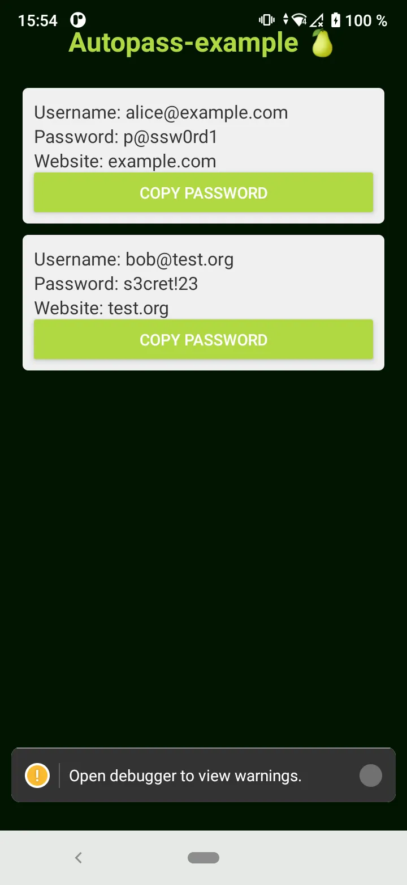

# Bare Mobile Application Example

Example of App using <https://github.com/holepunchto/react-native-bare-kit> followiing this tutorial: <https://docs.pears.com/guide/making-a-bare-mobile-app.html>

This app is a simple password manager that uses a P2P vault to store and sync passwords. The vault is implemented in the `autopass-invite` folder and can be run separately.

## Usage

First run the vault and then run the app. 

### Vault

```bash
cd autopass-invite
npm install
node serve.js
```

> [!TIP]
> Following times just run `node serve.js` to start the vault.

The output:

```sh
> node serve.js
INVITE: yrysguf87fr8p1xggbat9wbp7rmrkxya6tz3j1eds3onjk83a9187badtyddgoocdoewbbdf3cck6gquow51zyx3uj69zxos1m8uuzcg4c
Vault path: C:\...\.autopass-vault
Vault seeding... waiting for peers to connect and sync...

Use the above invite code to connect your mobile app to the vault.
```

> [!WARNING]
> Leave this running and then start the app.

### App

Installation (only the first time):
```bash
npm i b4a bare-fs bare-rpc corestore autopass @react-native-clipboard/clipboard graceful-goodbye
npm i bare-pack @types/b4a --save-dev
```

Set your properties in local.properties file:
```
sdk.dir=C:/.../Android/Sdk
org.gradle.java.home=C:/.../openjdk23/current
```

Run the app:
```bash
npm run android
```

Now in your phone you should see the app running and asking for the invite code. Copy the invite code from the vault output and paste it in the app. The app will connect to the vault and sync the passwords:


